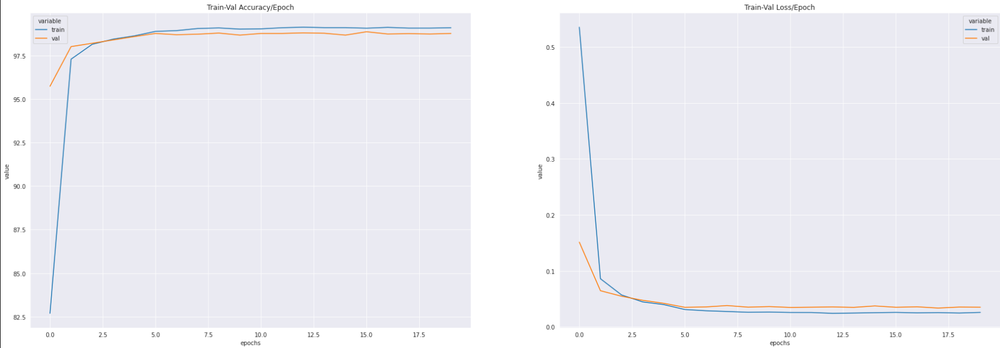
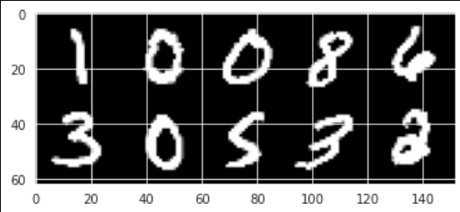
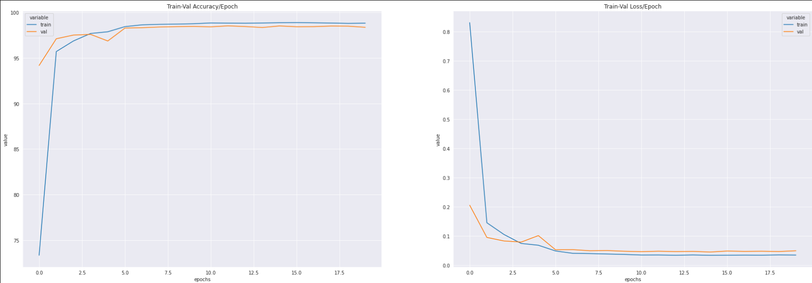
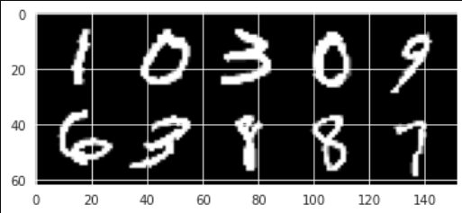
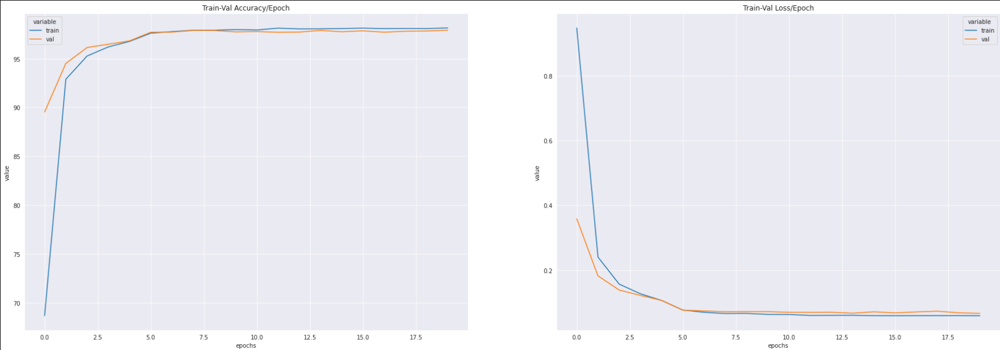
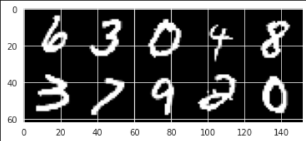
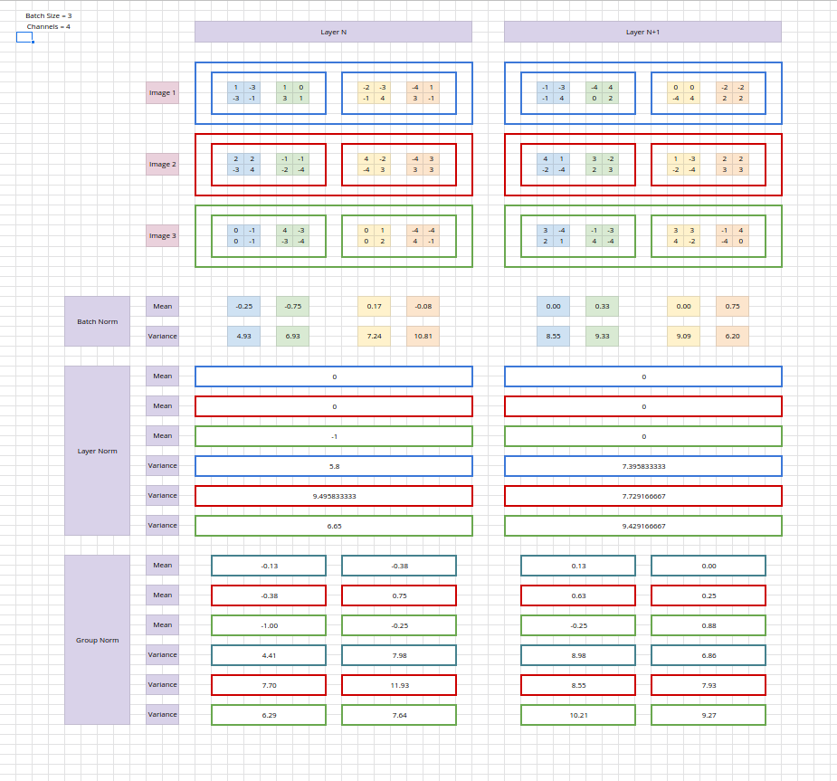

# Assignment 6

## Norm Experiments

The folder contains a runner file called `main_nb.ipynb`. Helper files are present in `./utils/`. Helper files are: 

1. `load_data.py`
    - Contains dataset and sampler functions.
2. `load_model.py`
    - Contains model definition and functions to calculate the number of parameters in the model.
3. `train_loop.py`
    - Train loop for train and validation sets.
4. `test_loop.py`
    - Test loop for test set.

The `main.py`/`main_nb.ipynb` imports from the `utils/` directory. It initializes the model, optimizer, dataloader, loss, scheduler, train loop, and test loop.

### 1. BatchNorm

#### Stats
Train Accuracy: `99.083%`  
Validation Accuracy: `98.755%`   
Test Accuracy: `99.25%`  

#### Graphs - Loss/Accuracy

#### Misclassified Samples

### 2. Group Norm

#### Stats
Train Accuracy: `98.795%`  
Validation Accuracy: `98.340%`  
Test Accuracy = `98.99%`  

#### Graphs - Loss/Accuracy

#### Misclassified Samples

### 3. Layer Norm

#### Stats
Train Accuracy: `98.147%`  
Validation Accuracy: `97.915%`  
Test Accuracy = `98.27%`  

#### Graphs - Loss/Accuracy

#### Misclassified Samples

### Overall Result

The performance ranking (based on accuracy) between the three norms are: 

`batch-norm` > `group-norm` > `layer-norm`

## Norm Calculation

The norm-calculation excel sheet is `norm_calc.xlsx`.

